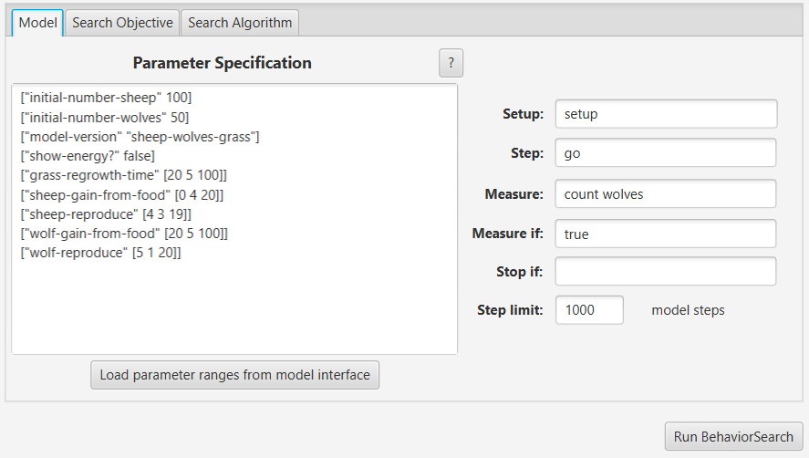
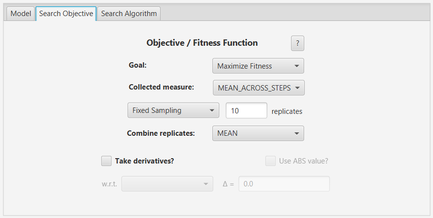
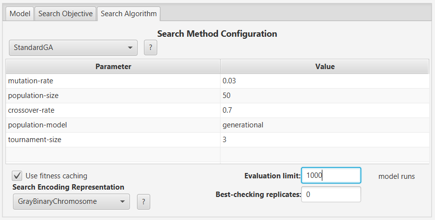
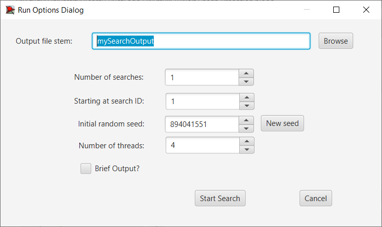
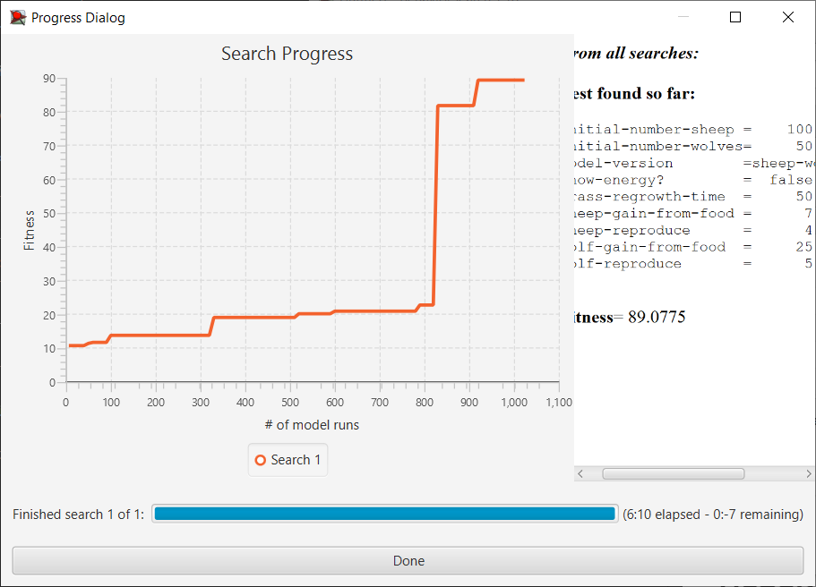
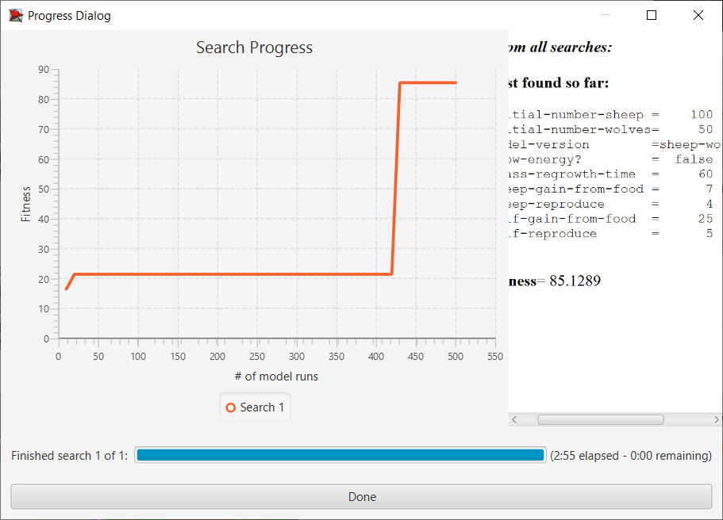
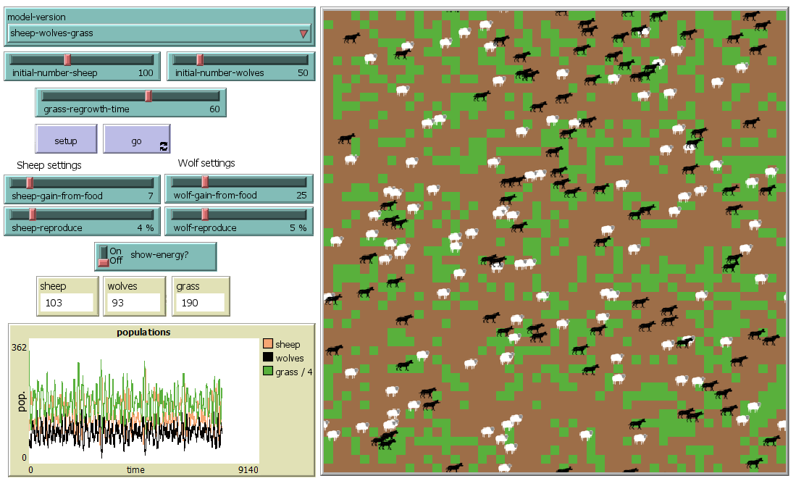

# Комп'ютерні системи імітаційного моделювання

СПм-22-5, Прудіус Микита Андрійович

Лабораторна робота №3. Використання засобів обчислювального интелекту для оптимізації імітаційних моделей

Варіант 7, модель у середовищі NetLogo: [Wolf Sheep Predation](http://www.netlogoweb.org/launch#http://www.netlogoweb.org/assets/modelslib/Sample%20Models/Biology/Wolf%20Sheep%20Predation.nlogo)

Вербальний опис обраної моделі знаходиться у [1 лабораторній роботі](../1/Laboratory_work_1.md#вербальний-опис-моделі).

## Налаштування середовища BehaviorSearch

Параметри моделі (вкладка Model):

<br/>["initial-number-sheep" 100]
<br/>["initial-number-wolves" 50]
<br/>["model-version" "sheep-wolves-grass"]
<br/>["show-energy?" false]
<br/>["grass-regrowth-time" [20 5 60]]
<br/>["sheep-gain-from-food" 7]
<br/>["sheep-reproduce" 4]
<br/>["wolf-gain-from-food" [20 5 100]]
<br/>["wolf-reproduce" [5 1 20]]

Використовувана міра:
У якості цільової функції було обрано значення кількості вовків, вираз для її розрахунку взято з налаштувань графіка аналізованої імітаційної моделі в середовищі NetLogo 


та вказано у параметрі "Measure":

``` NetLogo
count wolves
```

Кількість вовків повинна враховуватися в середньому за весь період симуляції тривалістю, для приклада, 1000 тактів, починаючи з 0 такту симуляції.

Параметр "Mesure if" має значення *true*, бо нам цікаве кожне значення показника.

Параметр зупинки за умовою "Stop if" не використовувався.

Загальний вигляд вкладки налаштувань параметрів моделі:



## Налаштування цільової функції (вкладка Search Objective):

Метою підбору параметрів імітаційної моделі, є максимізація середньої кількості вовків для врівноваження збільшеної кількості овець (за рахунок збільшення народжуємості та кількості отриманої енергії) – це вказано через параметр "Goal" зі значенням *Maximize Fitness*. Тобто необхідно визначити такі параметри налаштувань моделі, за яких система буде стабільною з найбільшою кількість вовків. Середня кількість цікава за всю симуляцію. Для цього у параметрі "Collected measure", що визначає спосіб обліку значень обраного показника, вказано *MEAN_ACROSS_STEPS*.

Щоб уникнути викривлення результатів через випадкові значення, що використовуються в логіці самої імітаційної моделі, кожна симуляція повторюється по 10 разів, результуюче значення розраховується як середнє арифметичне.

Загальний вигляд вкладки налаштувань цільової функції:



## Налаштування алгоритму пошуку (вкладка Search Algorithm):

Загальний вид вкладки налаштувань алгоритму пошуку:



## Результати використання BehaviorSearch



Результат пошуку параметрів імітаційної моделі, використовуючи генетичний алгоритм:


Результат пошуку параметрів імітаційної моделі, використовуючи випадковий пошук:


## Перевірка результатів



Спостерігаємо, що отримані параметри з двох алгоритмів є однаковими, тому у даному випадку немає кращого алгоритму пошуку оптимальної моделі. Отримана модель демонструє стабільність із середньою кількістю вовків приблизно 90.
